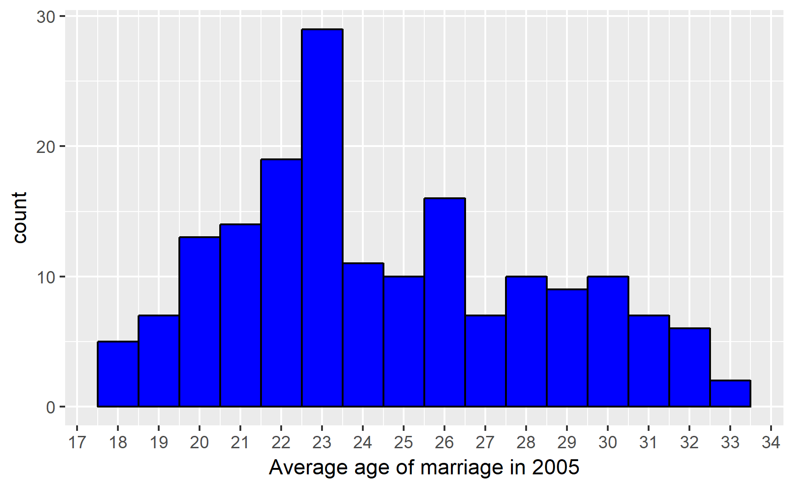
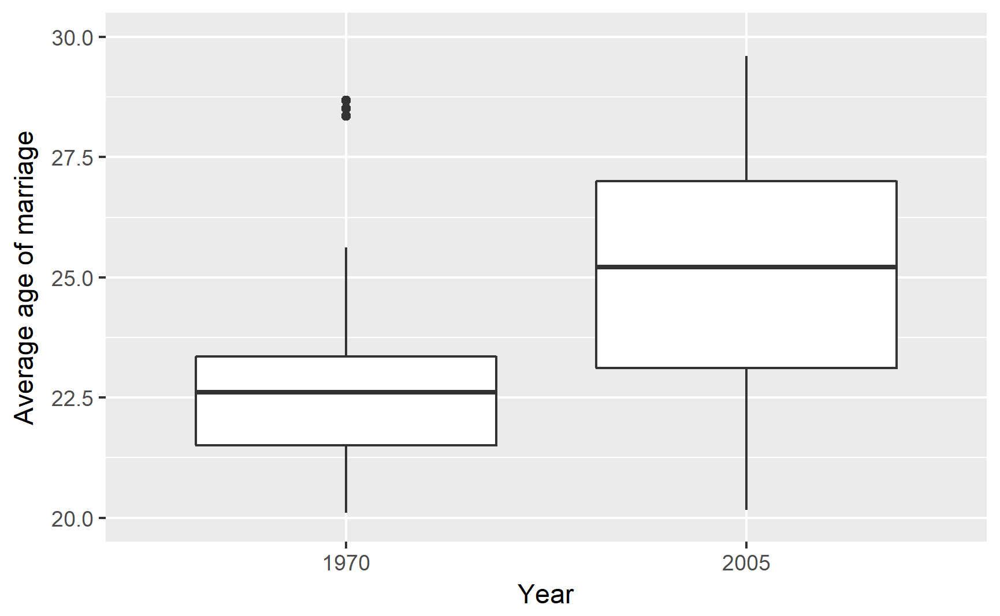
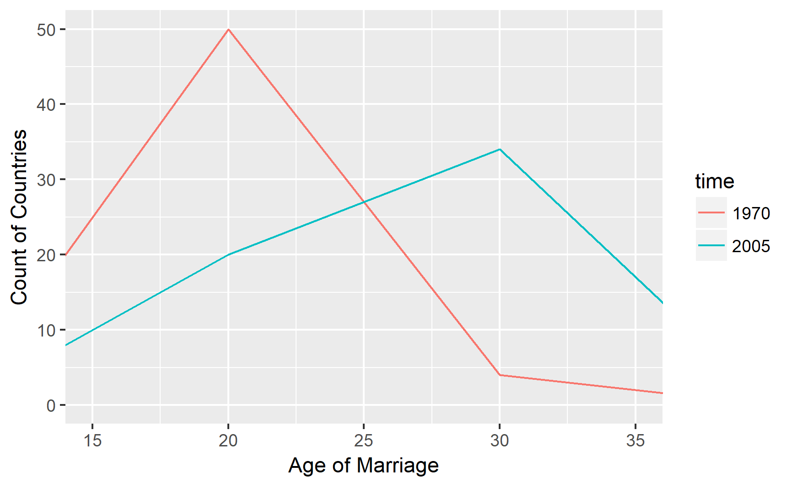

### Lesson 4 Problem Set: Gapminder Data
#### Author: Liang Sun
#### Date: June 14, 2017
---

From Gapminder I downloaded the data file  on the average age of marriage of countries over time.

#### 1. Preparing data
Read data file in R:
```{r}
getwd()
list.files()

marriage <- read.csv('age of marriage.csv', header = TRUE)
```

Check the variable names in the data file:
``` {r}
names(marriage)
```


Column names have "X" as prefix, so need to remove "X" from col names:
```{r}
names(marriage) <- gsub("X", "", names(marriage), fixed = TRUE)
# the first column is country
colnames(marriage)[1] <- "country"
```


Before start drawing graphs, we need to do some data wrangling work, because there are many missing values in these yearly data:

```{r}
mar05 <- na.omit(marriage['2005'])
summary(mar05)
```


---
#### 2. Creating plots
- Create a histogram: the average age of marriage by country in 2005.
``` {r}
library(ggplot2)
ggplot(aes(x = mar05), data = mar05) +
      labs(x = "Average age of marriage in 2005") +
  geom_histogram(binwidth = 1, color = 'black', fill = 'blue') +
  scale_x_continuous(breaks = 17:34)
```


- Create a boxplot over two years: very few years have many valid values.

```{r}
years <- c('country','1970', '2005')

two_data <- na.omit(marriage[years])

colnames(two_data)[2] <- 'year_1970'
colnames(two_data)[3] <- 'year_2005'
```
Reshape into long format so as to draw plot of two years:
```{r}
two_data <- reshape(two_data, varying = c('year_1970', 'year_2005'),
                    idvar = 'country', direction = 'long', sep = '_')
```
Then need to change time into a factor variable so as to compare two years:
```{r}
two_data$time <- as.factor(two_data$time)
```

Draw the plot:
```{r}
qplot(x = time, y = year,
      data = two_data,
      xlab = 'Year',
      ylab = 'Average age of marriage',
      geom = 'boxplot') +
      scale_y_continuous(limits = c(20, 30))  
```



- Create a frequency polygon:

```{r}
qplot(x = year, y = ..count..,
      data = two_data,
      xlab = 'Age of Marriage',
      ylab = 'Count of Countries',
      binwidth = 10, geom = 'freqpoly', color = time) +
  coord_cartesian(xlim = c(15, 35))
```



---
#### 3.Discussion

- If we look at 2005 data only, the average age of marriage in most countries is between 22 and 27 years old. However, we cannot interpret much meaning based on only one-year data.

- By comparing 1970 and 2005 data in boxplot and frequency polygon, it is obvious that the average age of marriage has grown over time for all countries.

- Nevertheless, the data are quite flawed in the sense that many countries have missing values in many years. The findings here may be not representative enough of the world.
